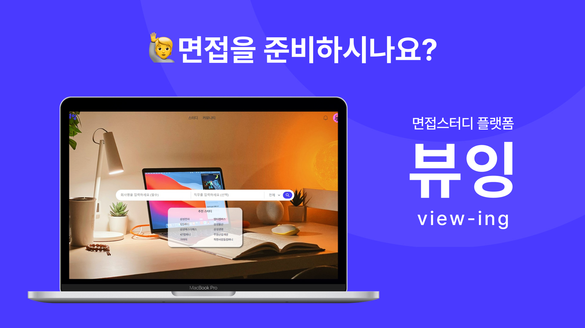
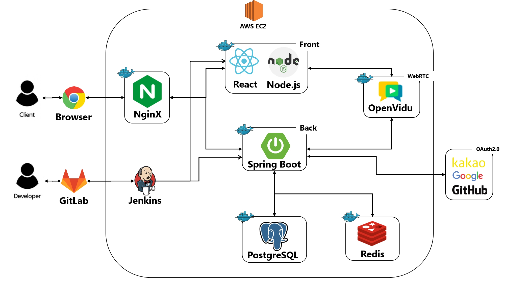
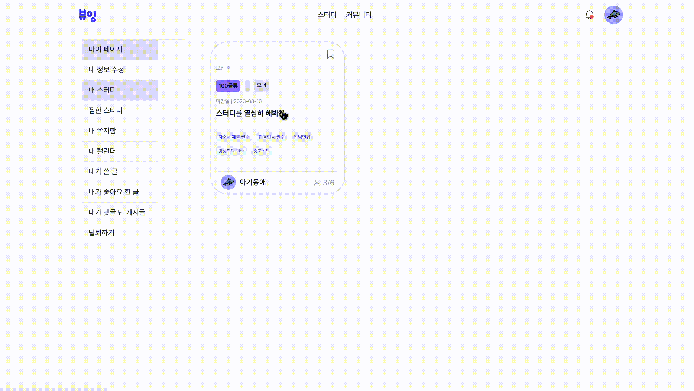
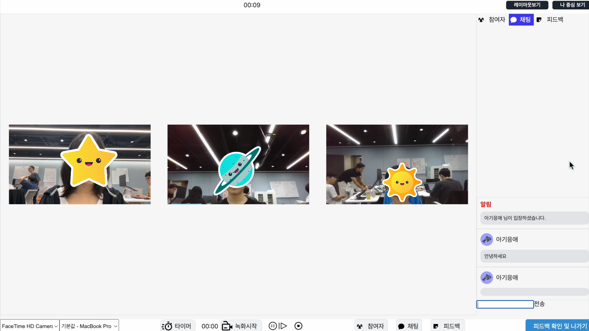
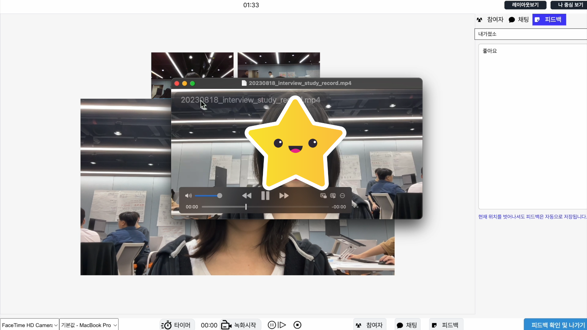
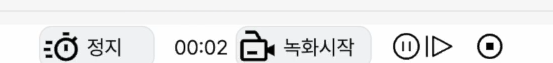
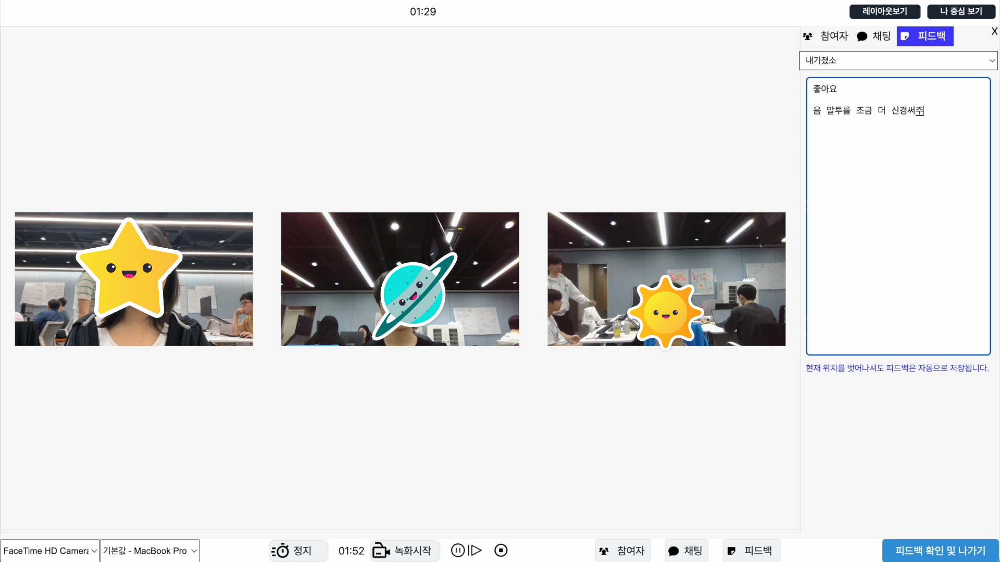
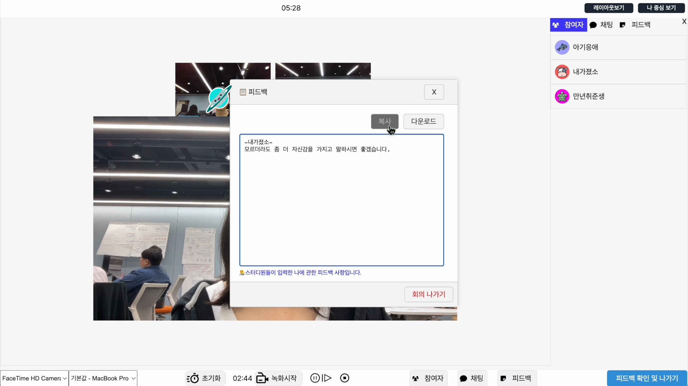
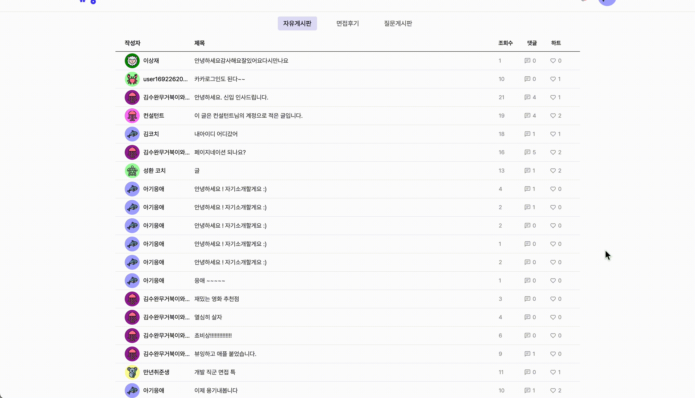
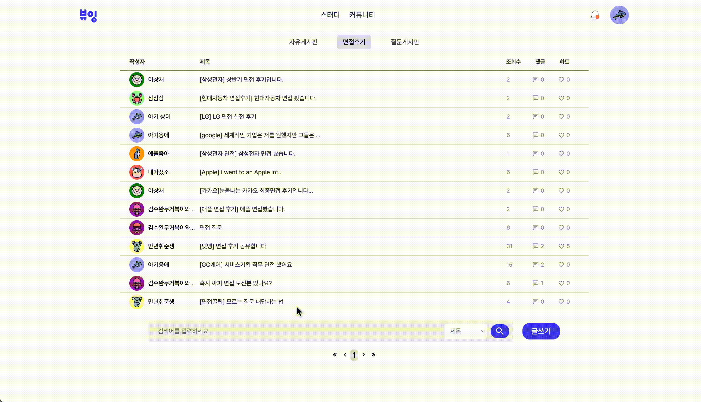

# 뷰잉 (view-ing)

 

 

## "뷰잉은 면접스터디를 위한 통합 솔루션입니다."

### 👨‍👩‍👧‍👦 사용자

면접 스터디 구인에 어려움을 겪는 사람 
면접 관련 커뮤니티가 필요한 사람 
면접 연습을 하며 피드백을 주고받고 싶은 사람

### 💁 사용방법

면접을 압둔 기업의 이름을 검색해보세요. 
원하는 스터디가 있다면 가입 신청을 해보세요. 
없다면 직접 스터디 생성하기 !

### ⏰ 개발 기간

2023.07.10 ~ 2023.08.17

 

## 📁 분석 설계

### API 명세서 링크(NOTION)

[API 명세서](https://chartreuse-wrench-b31.notion.site/Viewing-API-3b19fa9893fa802faf9acce55358820a)

### ERD 링크

[ERD](https://www.erdcloud.com/d/T43jjEq9d8XXDzow6)

### 시스템 아키텍처

 
열어서 확인하기

    

 

## ⚙️ 기술 스택

 

## 🖥️ 주요 화면 / 구현 예시

 
스터디

### ✍ 스터디 검색 & 신청

 

### ✍ 스터디 관리 (방장)

  
  

### ✍ 스터디 기능

  

 
영상회의

### ✍ 기본 기능

  

### ✍ 녹화, 타이머

  
  
  

### ✍ 피드백 기능

  

  

 
커뮤니티

### ✍ 게시글

  

### ✍ 게시글 작성

 

### ✍ 게시글 검색 및 댓글

  

